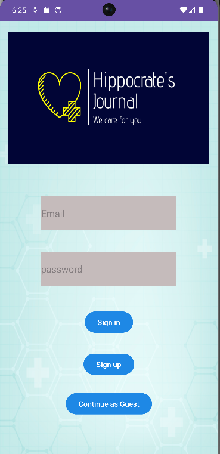
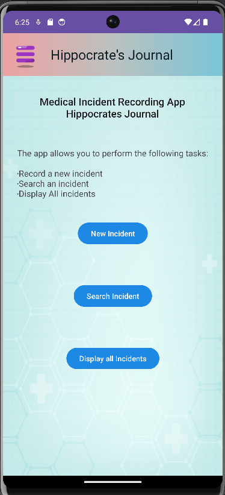
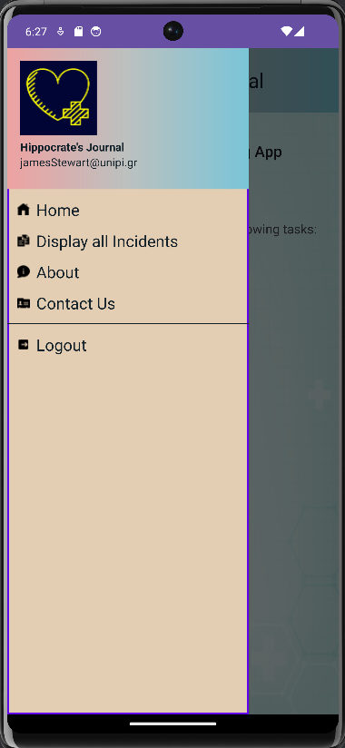
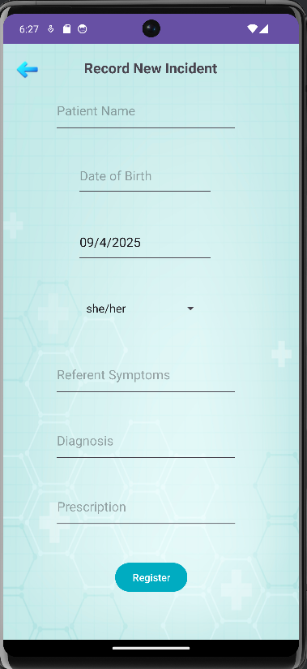
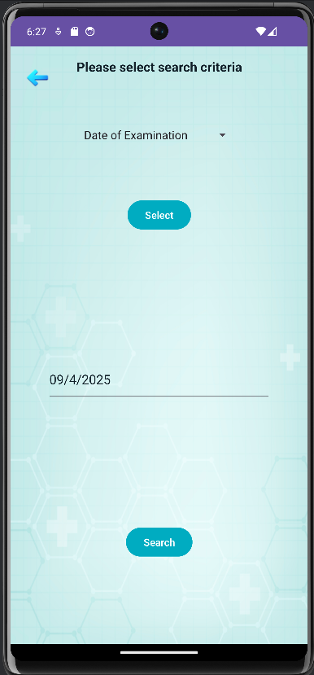
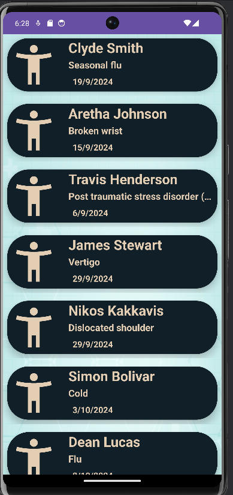
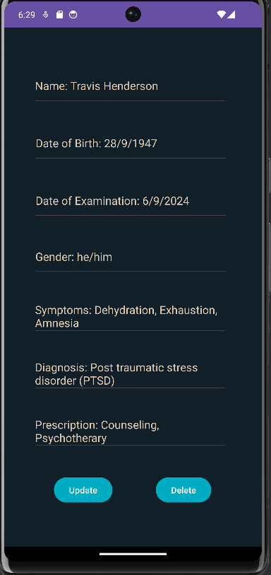

# 📜 Hippocrate's Journal

A mobile Android application built with Java to assist medical professionals in recording and managing patient medical incidents. The app provides a user-friendly interface for securely registering, searching, updating, and deleting patient incident records. All data is stored and retrieved in real-time using Firebase Authentication and Firebase Realtime Database. Named after Hippocrates, an ancient Greek physician and philoshopher, considered to be the "Father of Medicine".

> 🎓 Developed during my MSc in Informatics as a demonstration of mobile app development, Firebase integration, and patient-centric data management.

---

## 📚 Table of Contents

- [Features](#-features)
- [Technologies Used](#-technologies-used)
- [Core Object-Oriented Concepts](#-core-object-oriented-concepts-demonstrated)
- [Main Screens Overview](#-main-screens-overview)
- [Firebase Structure](#-firebase-structure)
- [Future Enhancements](#-future-enhancements)
- [How to Run on PC](#-how-to-run-on-pc)
- [How to Install & Run APK](#-how-to-install--run-the-apk-on-android)
- [Preview](#-preview)

## 🧰 Features

- 🧑‍⚕️ **User Authentication**: Health professionals can Sign in, sign up (email & password), or proceed as guests using Firebase Authentication
- 📝 **New Incident Registration**: Record patient details including name, DOB, gender, symptoms, diagnosis, and prescription
- 🔍 **Search Incidents**: Dynamically search by Name, Date of Examination, or Diagnosis
- 🩺 **Display All Incidents**: View all recorded medical incidents via a RecyclerView list
- ✏️ **Detailed View with Edit/Delete**: Tap on an incident to view details; authorized users can update or delete records
- 🚶 **Visitor Mode**: Read-only access for guest users
- 🌐 **Localization**: Supports English and Spanish language preferences

---

## 🔧 Technologies Used

- Java (Android SDK)
- Firebase Realtime Database & Authentication
- SharedPreferences for storing user session data
- DatePickerDialogs for DOB and Examination Date
- RecyclerView + Custom Adapter for incident lists
- AlertDialogs and Toasts for interaction feedback

---

## 💡 Core Object-Oriented Concepts Demonstrated

- **Encapsulation**: Private fields in models and safe access via getters/setters
- **Separation of Concerns**: Distinct activity classes per feature (e.g., Main, NewIncident, Search)
- **Reusable Components**: Custom `IncidentAdapter` for rendering cards in a RecyclerView
- **Data Models**: Custom `Incident` POJO for Firebase integration

---

## 📖 Main Screens Overview

- **Welcome Screen**: Sign in, Sign up, or Continue as Guest
- **Main Screen**: Navigation drawer + quick-access buttons for Register, Search, and View All
- **New Incident**: Form-based entry with date pickers and gender spinner
- **Search Activity**: Choose search criteria and input value
- **Search Results**: Shows matching incidents (if any)
- **Detailed Incident View**: Displays incident info and allows edit/delete if user is authenticated

---

## 📁 Firebase Structure

```
Firebase Realtime Database:

/incidents
   |- UniqueKey123
       |- name: "John Doe"
       |- dateOfBirth: "01/01/1990"
       |- dateOfExamination: "05/04/2025"
       |- gender: "Male"
       |- symptoms: "Fever, Cough"
       |- diagnosis: "Common Cold"
       |- prescription: "Rest, Fluids"
```

---

## 📊 Future Enhancements

- Export incidents to PDF/CSV
- Integrate charts or statistics for visual analytics
- Role-based access control for Doctors/Admins
- Dark mode

---

## 🖥️ How to Run on PC

- Clone the repository
- Open in **Android Studio**
- Connect your Firebase project and set up `google-services.json`
- Sync Gradle and Run on Emulator or Device

> Note: Make sure Firebase Authentication and Realtime Database are configured in your Firebase Console

---

## 📱 How to Install & Run the APK on Android

If you don't want to set up Android Studio, you can simply install the app by downloading the APK on [MEGA cloud drive](https://mega.nz/folder/MiRggaYa#L6hvSTavYqzOu298-Ddv_Q)

---

## 🖼️ Preview

### Welcome Screen


### Main Screen


### Navigation Drawer Use


### Register New Incident


### Search Incident


### Display Incidents View


### Selected Incident View


